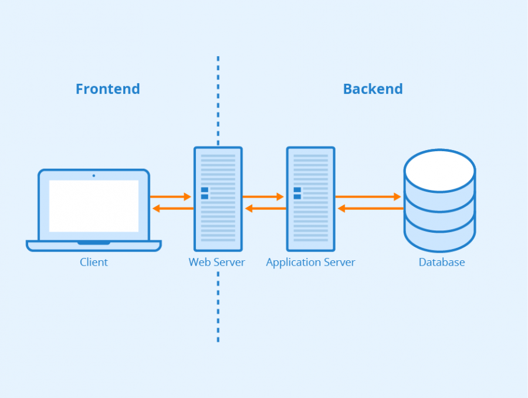
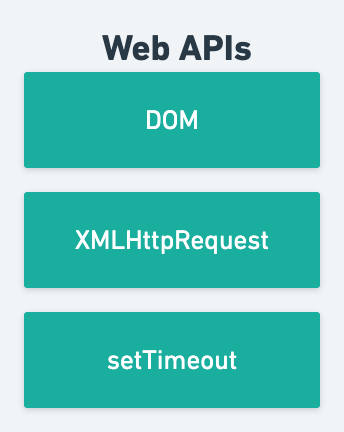
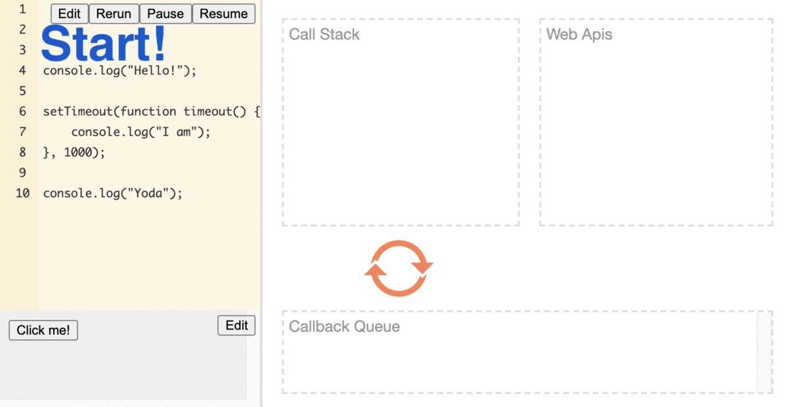

# Node.js Intro + The Event Loop

# Objectives
- `Understand the need for higher-level programming languages`
- `Articulate how Javascript and Node.js are related, but different`
- `Demonstrate the different phases of the event loop`

## Key Vocabulary
- Coding environment
- Higher-level programming
- Compiled vs Interpreted code
- Single-threaded
- Asynchronous
- Event loop
- Call stack
- WebAPI

# What is Node.js?

If we go to the Node.js (Node, for short) [website](https://node.js.org/en/) we get the following definition:

```
Node.js® is a JavaScript runtime built on Chrome's V8 JavaScript engine.
```

That is a very technical, somewhat mysterious description. To dip a toe in, Node.js is a Javascript runtime environment, meaning it's a place where we can run Javascript code! There are lots of <kbd>coding environments</kbd>: Web Browsers (like Firefox or Chrome), Node.js, your computer, my computer - are all different environments that can run code.

In this lesson we will clarify more about Node.js, understand how it is different from the browser-based Javascript we've been working with so far, and finally we will run our first Node.js code!

In order to get there, we first need to take a step all the way back and look at some of the basics of how computer programs run.

# Objective 1: Higher-Level Programming Languages

### How does a computer program work?


In all our computers, whether desktop computers, laptops, or mobile phones, there are very smartly designed microprocessor chips that act as the brains behind the computer. These microprocessor chips are the ones that do all the calculations, interpretations and logic for your computer, and they only understand `binary code` (0s and 1s).


## Higher Level Programming Languages

As you can imagine, it is *very* hard to read or write binary code, so in the 1950s people developed a way to write instructions for computer in a language that is easier to understand. We call these <kbd>'Higher Level' or 'High-Level' programming languages</kbd>. Some of the earlier examples are C, Fortran, PASCAL and C++, to name a few.
<details>
<summary>
    Fun Fact
  </summary>
Your computer's operating system (e.g. macOS or Microsoft Windows) is an example of a computer program that is written in one of these high-level languages!
</details>
<p>&nbsp;</p>

In the diagram below (you can ignore 'Assembly Lanugage' for now):
- 💻 `Hardware` is your computer
- 0️⃣1️⃣ `Machine Code` is the binary code that is giving your computer instructions
- 📝 `High-Level Lanugages` are sitting on top of everything, getting <kbd>compiled</kbd> into binary code for the computer to understand.


`Check For Understanding:` Why do we have higher level programming languages?
<details>
<summary>
    Answer
  </summary>
These languages allow us to "abstract" away the binary code that underlies all of our computer programs, so we can write code in a more human readable way! Who has time to write 0s and 1s all day?!
</details>
<p>&nbsp;</p>

## Interpreted Languages

Now, where does Javascript fit into all this? Well, ✨ Javascript is special ✨. Javascript is also a high level language, in that it's human-readable and it automates a lot of things like memory allocation, but its code does **not** directly <kbd>compile</kbd> to binary. It is referred to as an <kbd>interpreted</kbd> language, in other words, you need an interpreter to understand how to run it!

Javascript was developed in the 1990s to add interactivity, animations, and little bits of automation to websites.

*Before Javascript, remember websites looking like this??*

*Altavista website by Christiaan Colen - via [link](https://www.flickr.com/photos/christiaancolen/18598795371)*

But, Javascript was first built *just* for use in Web browsers, it didn't need to compile to binary because it was not going to be run on a machine - it would be <kbd>interpreted</kbd> by and run in the Web browser.


## Web Browser
Your Web browser (Google Chrome, Safari, Firefox, etc.) is just a ✨ special ✨ computer program (also written in a High-Level programming language), that does the following:

1. `Make network requests to the Internet and retrieve data.`
2. `Interpret and display the data it recieves.`

**Javascript, HTML and CSS are all *interpreted* by your web browser on the fly.**


Javascript ONLY works if a computer program such as a Web browser interprets it.

`Check for Understanding:` In an earlier module you used Javascript to manipulate the DOM. What are a few (2-3) actions you could easily perform on HTML elements using Javascript?

<details>
<summary>
    Solution
  </summary>

  - getElementById()
  - createElement()
  - querySelector()
  - appendChild()
  - replaceChild()

  ...and so many more!

</details>
<p>&nbsp;</p>

`Check for Understanding:` If I pull up Etsy.com to check out cute handmade ceramic mugs, what on my computer is actually interpreting the Javascript that the Etsy developers wrote?

<details>
<summary>
  Solution
  </summary>
    My Web browser! For me, that's Google Chrome.
</details>
<p>&nbsp;</p>

# Objective 2: What Does Node.js Add to Javascript?
## Google's Javascript Engine: V8

One of the modern browsers, Google Chrome, uses something called the `Chrome V8 engine` 🚒 to interpret Javascript.

Let's take a look at the official Chrome V8 website: [https://developers.google.com/v8/](https://developers.google.com/v8/)


> V8 is Google’s open source high-performance JavaScript engine, written in C++ and used in Google Chrome, the open source 
> browser from Google, and in Node.js, among others. It implements ECMAScript as specified in ECMA-262, and runs on Windows 
> 7 or later, macOS 10.5+, and Linux systems that use IA-32, ARM, or MIPS processors. V8 can run standalone, or can be 
> embedded into any C++ application. More information can be found on V8's public wiki.

This is the specific browser tool that Google uses to run and <kbd>interpret</kbd> Javascript on all our Google Chrome web browsers.

But one day, a man named Ryan Dahl thought: **What if we just run this V8 Javascript Engine on it's own without a browser on a computer? This way, we can use it to write server-side code using Javascript!**

✨ **That's how Node.js was born.** ✨
<p>&nbsp;</p>

## Node.js Environment and Addons to Javascript
In short, a web server is just a computer serving data on the internet.



*Figure: Frontend vs. Backend - Author: Seobility - via [link](https://www.seobility.net/en/wiki/Frontend)*

With the Google V8 Javascript Engine, it's possible to serve webpages, connect to databases, and manage files all on the server side.

But the thing is, stand-alone Javascript in the browser does not have a lot of the capabilities we need to do that server-side programming. Browser-based Javascript, for example, can make a button on a webpage clickable, but it wouldn't expect to make a network call to another website. So, in order to do these new server-side tasks, Node.js adds many new libraries and additional tools to allow us to do the following:

1. `Input/Output Buffers`: Handle binary data
2. `File System`: Manage file system on your machine
3. `HTTP Networking`: Allows you to handle requests and responses
4. `Streams and Pipes`: Allows you to handle data in chunks as it comes in. (Example: Video streaming)
5. `Access to the Operating System`

These are some of many new things you can do with Javascript in the Node.js environment. Thanks to Node.js and the V8 Engine, Javascript can now directly interface with your machine! 👏

`Check for Understanding`: Why couldn't I access my computer's operating system with Javascript before Node.js existed?
<details>
<summary>
    Solution
  </summary>
  Javascript is a "client-side" language (think, web applications), and before Node.js, we did not have a tool to allow Javascript to talk to server-side applications like operating systems. Now, we are able to run servers in Node.js, which is also able to <kbd>interpret</kbd> Javascript, so we can bridge the gap between Javascript and server-side tech!
</details>
<p>&nbsp;</p>
<details>
<summary>
    Important Note
  </summary>
  😊 You're doing great! 😊
</details>
<p>&nbsp;</p>

# Objective 3: The Event Loop

You might have heard that JavaScript is <kbd>single-threaded</kbd> , this means it can only do one task at a time, and must wait for that task to finish before picking up another one. You may have also heard that it's [<kbd>asynchronous</kbd>](https://developer.mozilla.org/en-US/docs/Learn/JavaScript/Asynchronous/Concepts), meaning while it waits on a longer task to finish, it can pick up a different task. Well, hold on, that doesn't make sense, how could it be both?! Good question!

Answer: JS itself is <kbd>single-threaded</kbd>, and it's <kbd>asynchronous</kbd> behavior is built on top of the core JS language in the browser (or other programming environment) and is accessed through the browser APIs.
Take a look at the following picture:


Let's break down the different parts of the picture and see if we can get it to make more sense.

- The outer box is the Google Chrome that we know and love. For this example that is our <kbd>coding environment</kbd>.

- The next box we see is the JS box. This is where our code runs.

  

  The <kbd>call stack</kbd> is how Javascript keeps track of all of the function chaos! Since Javascript is <kbd>single-threaded</kbd> (one thing at a time), the <kbd>call stack</kbd> is it's way of determining what function to run at any point. If you are at the top of the <kbd>call stack</kbd>, you're up next!
  We can only push and pop things onto our stack.
  


- Our <kbd>WebAPIs</kbd> is where the 🔮*magic*🔮 happens. This is where our DOM lives, and this is where our <kbd>asynchronous</kbd> calls such as SetTimeout, SetInterval, AJAX calls, and our event listeners go, since Javscript itself cannot handle asynchronicity.

  

  When we hit an <kbd>asynchronous</kbd> call in our stack, the call gets moved over to the <kbd>WebAPIs</kbd> area until it resolves.

  This means that if our code has a `setTimeout` with a time of 5 seconds, that call will move over to the <kbd>WebAPI</kbd> and wait for 5 seconds.

  

  Once a <kbd>WebAPI</kbd> has resolved, it then moves into the callback queue. A queue means the first thing in, is the first thing out. Unlike a stack, where the first thing in might get buried by the newer items on top, a queue is like waiting in line. Or like only being able to use `.shift` and `.push` with an array.

  The items in the queue get resolved only once the <kbd>call stack</kbd> is clear. Once the stack is clear it will take the first item from the queue and put it into the <kbd>call stack</kbd>. Once the <kbd>call stack</kbd> is clear again, the process will be repeated.

This circular motion of <kbd>call stack</kbd>, to <kbd>WebAPI</kbd>, to callback queue, to <kbd>call stack</kbd> is the 🌀 <kbd>_Event Loop_.</kbd>🌀


<br>

***
<br>

## Let's Try It!
Using this information about the Event Loop, let's see if we can predict the order that things will occur:

```js
console.log("Hello,");
setTimeout(() => console.log("I am"), 1000);
console.log("Yoda");

```

`Question:` What is the expected output?

<details>
  <summary>
    Solution
  </summary>


    Hello,
    Yoda
    I am
</details>
<p>&nbsp;</p>


Let's take a look at why:
>The first thing that will be moved onto our stack is  `console.log("Hello,");`. This immediately resolves and is popped off our stack.

>The next thing pushed onto the stack is the `setTimeout`. Because this is an <kbd>asynchronous</kbd> call it will get moved over from our stack to the <kbd>WebAPI</kbd> and begin to count down for 1 second.

>Our code continues to run and pushes the `console.log("Yoda")` onto our empty stack. This immediately resolves and is then popped off the <kbd>call stack</kbd>.

>After 1 second, our `setTimeout` resolves and moves the callback (our `timeout function`) to the callback queue.

>Because our <kbd>call stack</kbd> is empty, the first item of our callback queue (`timeout()`) is moved onto the stack. The `console.log("I am")` is
immediately resolved and popped off the stack.

>Our code finishes running.


<details>
  <summary>
    Solution Animation
  </summary>

  
</details>
<p>&nbsp;</p>


Alright, now let's try another example:

```js
console.log("Hello,");
setTimeout(() => console.log("I am"), 0);
console.log("Yoda");
```

`Question:` What do we think the output to screen will be now?

<details>
  <summary>
    Solution
  </summary>


    Hello,
    Yoda
    I am

   The output will be identical to the previous example. The reason: Regardless, of how quickly our setTimeout is set to resolve (in this case, in 0 seconds), it is still moved into the WebAPI.
</details>
<p>&nbsp;</p>


`Question:` How could we change the above code to make the output be <kbd>Hello, I am Yoda</kbd> ?

<details>
  <summary>
    Solution
  </summary>

  ```js
  console.log("Hello,");
  console.log("I am");
  console.log("Yoda");
  ```
  or

 ```js
  console.log("Hello,");
  setTimeout(() => console.log("Yoda"), 0);
  console.log("I am");
  ```

</details>
<p>&nbsp;</p>

And one more!

 ```js
  setTimeout(() => console.log("Luke"), 5000);
  console.log("I am");
  setTimeout(() => console.log("your father"), 0);
  ```

`Question:` What is the expected output?

<details>
  <summary>
    Solution
  </summary>


    I am
    your father
    Luke

>First, the `"Luke"` setTimeout is moved from the call stack to the WebAPIs area to wait for 5 seconds.

>Then, the `console.log("I am")` gets put on the call stack and resolves immediately.

>Next, the `"your father"` setTimeout is moved from the call stack to the WebAPIs area, but waits for 0 seconds, and then is moved straight to the callback queue while the `"Luke"` setTimeout is still in the WebAPI.

>The `"your father"` setTimeout gets moved to the call stack and resolved.

>Finally, the `"Luke"` setTimeout finishes waiting, is moved to the callback queue, and then the call stack to resolve.
</details>
<p>&nbsp;</p>

*Still scratching your head?*

Check out this really cool [visual example](https://dev.to/lydiahallie/javascript-visualized-event-loop-3dif), or try some of our problems in this [interactive example](http://latentflip.com/loupe/?code=JC5vbignYnV0dG9uJywgJ2NsaWNrJywgZnVuY3Rpb24gb25DbGljaygpIHsKICAgIHNldFRpbWVvdXQoZnVuY3Rpb24gdGltZXIoKSB7CiAgICAgICAgY29uc29sZS5sb2coJ1lvdSBjbGlja2VkIHRoZSBidXR0b24hJyk7ICAgIAogICAgfSwgMjAwMCk7Cn0pOwoKY29uc29sZS5sb2coIkhpISIpOwoKc2V0VGltZW91dChmdW5jdGlvbiB0aW1lb3V0KCkgewogICAgY29uc29sZS5sb2coIkNsaWNrIHRoZSBidXR0b24hIik7Cn0sIDUwMDApOwoKY29uc29sZS5sb2coIldlbGNvbWUgdG8gbG91cGUuIik7!!!PGJ1dHRvbj5DbGljayBtZSE8L2J1dHRvbj4%3D) !

***

### Event Loop Key Takeaways
- A single threaded language means one function runs at a time
- An asynchronous language means that the order in which functions are called are not necessarily the order they will resolve
- In understanding the Event Loop, you will be able to better predict the order that functions will run

***

## Extra Resources
- [Javascript Threads - MDN](https://developer.mozilla.org/en-US/docs/Glossary/Thread)
- [The Call Stack - MDN](https://developer.mozilla.org/en-US/docs/Glossary/Call_stack)
- [The Event Loop - MDN](https://developer.mozilla.org/en-US/docs/Web/JavaScript/EventLoop)
- [The Event Loop - JavaScript Tutorial](https://www.javascripttutorial.net/javascript-event-loop/)
- [Event Loop Interactive Example w/ ES6 'Microtask Queue'](https://www.jsv9000.app/)