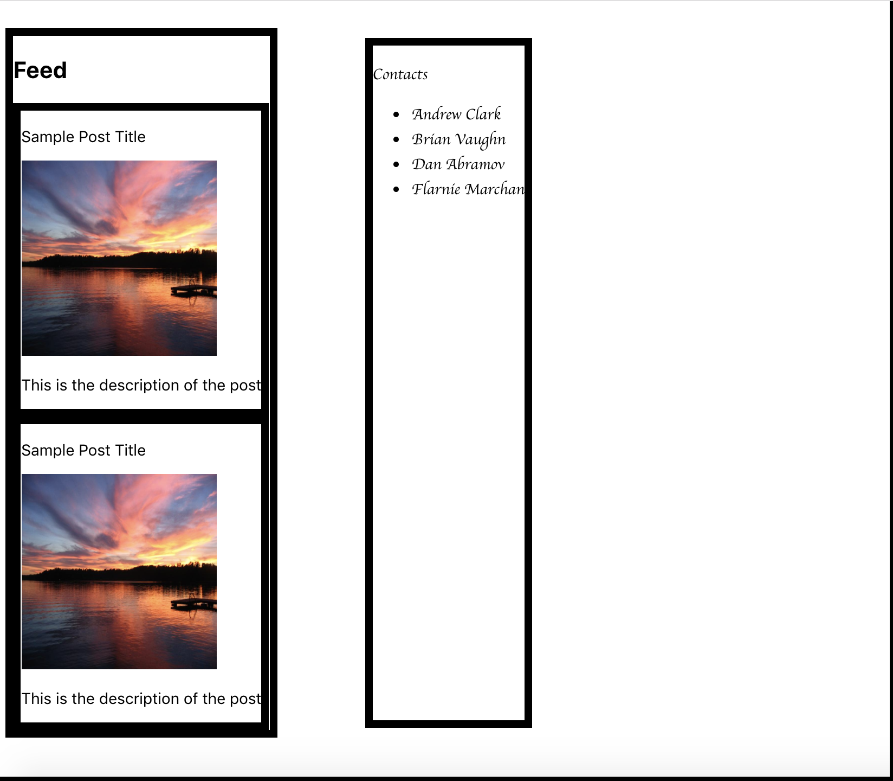

# Introduction to React

## Objectives

- Understand what React is and what problem it solves
- Create an application that uses React to render its front-end

## Readings

* [Why React?](https://reactjs.org/blog/2013/06/05/why-react.html)
* [React - Official Website](https://reactjs.org/)
* [W3Schools Introduction](https://www.w3schools.com/react/)
* [The Virtual DOM](https://www.codecademy.com/articles/react-virtual-dom)
* [Rendering Elements - React Docs](https://reactjs.org/docs/rendering-elements.html)
* [React.Component - React Docs](https://reactjs.org/docs/react-component.html)
* [Introducing JSX](https://reactjs.org/docs/introducing-jsx.html)
* [CodeSandbox - An online code editor for React](https://codesandbox.io)

## Vocabulary

* Virtual DOM
* Components
* React and React DOM
* `render`
* JSX

## Demo app

- [link](https://github.com/joinpursuit/Pursuit-Core-Web-React-Introduction-Project)

# 1. Introduction

## React

React is a JavaScript library that was created by Facebook.  It is used to build the UI components of applications.  Up until now, we have been building our UI by writing a single large HTML file, then linking it to a JavaScript file.  The JavaScript file uses DOM manipulation to edit, add, and remove elements in response to user interaction.  This approach has worked well for us so far, but has some challenges when scaling to larger applications.  Consider the following image:

:format(webp)/cdn.vox-cdn.com/uploads/chorus_image/image/63696407/facebook_website_redesign_1.9.jpg)


There are at least four entirely distant components that are on the page including:

- the top bar
- the left sidebar
- the stories feed
- the contacts list.  

Using our DOM manipulation approach, we would have all of these different elements in a single html file.  This would be challenging to maintain because we a bug in one area could easily affect the rest of the page.  

React solves this problem by introducing `Components`.  Instead of laying out all of our HTML in a single file, we can separate it into separate classes and combine those classes together.

## Virtual DOM

How does React build a single HTML page from multiple different components?  A first approach might be that whenever a component adds an HTML element (e.g creating a new comment), it redraws the entire DOM.  While this would work, the process would be quite slow.  The solution that React uses is to create a **virtual DOM** that represents the DOM.  Whenever one component changes, it updates that virtual DOM.  The VDOM then sees what changes were made, then only updates the DOM with those changes.  This way, the whole DOM doesn't need to be recreated.

Now that we have a better understanding of the motivations of React, let's create an app that uses React.

# 2. Setting up a Project with React

In this lesson, we'll create a React application that statically displays a very simple social media page.  To get started, navigate to the directory where you want your project, and run the following command:

```bash
npx create-react-app simple-social-media-app
```

`npx` will execute the package without installing it.  Read [stackOverflow](https://stackoverflow.com/questions/50605219/difference-between-npx-and-npm) for more information.  It will take a couple minutes for your application to be installed.  Navigate into your project, and you will see that it already has git setup with a single commit reading "Initial commit from Create React App". It has also created the following files:

- README.md         
- package-lock.json
- package.json      

And the following directories:

- public
- src
- node_modules      

Inside `src` are the following `js` and `css` files:

- App.css          
- App.test.js      
- index.js         
- serviceWorker.js
- App.js           
- index.css

`App.js` contains the code of our Application component, and `index.js` contains the code that renders our application.

Run the following command to view your application:

```bash
npm start
```

It will host a website on port 3000 that looks like this:


Let's dig into the project and get a better understanding of how it works.

# 3. JSX Syntax

Open the `App.js` file.  You should see the code below:

```js
import React from 'react';
import logo from './logo.svg';
import './App.css';

function App() {
  return (
    <div className="App">
      <header className="App-header">
        
        <p>
          Edit <code>src/App.js</code> and save to reload.
        </p>
        <a
          className="App-link"
          href="https://reactjs.org"
          target="_blank"
          rel="noopener noreferrer"
        >
          Learn React
        </a>
      </header>
    </div>
  );
}

export default App;
```

`App` is a function with an odd-looking return value.  Inside the `()`, we see code that looks like a mixture of JavaScript and HTML.  This is a special syntax for React called `JSX`.  It is an extension to JavaScript that makes it easy to build React elements.  The following line is perfectly valid in JSX:

```js
const element = <h1>Hello, world!</h1>;
```

From the JSX in the return statement, we see another interesting bit of syntax:

```js

```

Much like how string interpolation is used to embed variables in strings, JSX uses `{}` to embed expressions.  Here, `logo` is the string `./logo.svg`

[React](https://reactjs.org/docs/introducing-jsx.html) gives the following example of how JSX can be used:

```js
function formatName(user) {
  return user.firstName + ' ' + user.lastName;
}

const user = {
  firstName: 'Harper',
  lastName: 'Perez'
};

const element = (
  <h1>
    Hello, {formatName(user)}!
  </h1>
);

ReactDOM.render(
  element,
  document.getElementById('root')
);
```

# 4. React Class Components

This `App` function is called from the `index.js` file:

```js
import React from 'react';
import ReactDOM from 'react-dom';
import './index.css';
import App from './App';
import * as serviceWorker from './serviceWorker';

ReactDOM.render(<App />, document.getElementById('root'));

// If you want your app to work offline and load faster, you can change
// unregister() to register() below. Note this comes with some pitfalls.
// Learn more about service workers: https://bit.ly/CRA-PWA
serviceWorker.unregister();
```

Because our `App` function returns a React element, it can be rendered to the virtual DOM.  Inside our `App.js` function, we can reference other React components, just like we can refer to `<p>` or ``.

Let's create a new component that our `App.js` will use.  This will list all of our Contacts:

`ContactList.js`
```js
import React from 'react';

class ContactList extends React.Component {
    render() {
        return (
            <div>
                <p>Contacts</p>
                <ul>
                    <li>Andrew Clark</li>
                    <li>Brian Vaughn</li>
                    <li>Dan Abramov</li>
                    <li>Flarnie Marchan</li>
                </ul>
            </div>
        )
    }
}

export default ContactList
```

The React element that we return must be children of a single element, so we wrap everything inside of a `div` tag.

Returning to our `App.js` file, we can now display our new component:

```js
import React from 'react';
import './App.css';
import ContactList from './ContactList.js';

function App() {
  return (
    <ContactList />
  );
}

export default App;
```

Every time that you save your application, the browser window will reload the changes that you've made.  You should now see the following screen:


Now, we can build the `Feed` component.  The feed should have some number of `FeedPost` inside of it.  We can nest components inside of each other to create more complex, dynamic structures.

The `FeedPost` class below uses `{}` to embed values from its stored `postInfo` property.  In later lessons, we'll see how we can pass in different properties for different posts:

`FeedPost.js`
```js
import React from 'react';

class FeedPost extends React.Component {
    postInfo = {
        title: "Sample Post Title",
        imageLink: "https://www.stockvault.net/data/2007/03/01/100169/preview16.jpg",
        description: "This is the description of the post"
    }
    render() {
        return (
            <div>
                <p>{this.postInfo.title}</p>                
                </img>
                <p>{this.postInfo.description}</p>
            </div>
        )        
    }
}

export default FeedPost;
```

With a `FeedPost` class constructed, we can build a `Feed` class that contains multiple `FeedPost`s.

`Feed.js`
```js
import React from 'react';
import FeedPost from './FeedPost.js';

class Feed extends React.Component {
    render() {
        return (
            <div>
                <h2>Feed</h2>
                <FeedPost />
                <FeedPost />
            </div>
        )
    }
}

export default Feed;
```

Returning to your browser, you should see the following image:


We have multiple components rendered on the page all at once!  Now we can add our own styling by configuring separate CSS files.

# 5. CSS and React

Because each of our components is its own separate module, we can create CSS files for each individual component.  This will help make it easier to work with individual components without worrying about the rest of the app.  Let's put a border around our `ContactList` and change the font to cursive.  First, we'll need to add the `className` to our `div`:

`ContactList.js`

```js
class ContactList extends React.Component {
    render() {
        return (
            <div className='ContactList'>
						...
				)
   }
}
```

Next, create a `ContactList.css` file:

`ContactList.css`

```css
.ContactList {
  font-family: cursive;
  margin: 50px;
  border: 8px solid;
}
```

Return to your `ContactList.js` and import your new CSS file:

`ContactList.js`

```js
import React from 'react';
import './ContactList.css';

class ContactList extends React.Component {
	...
}
```

Your application should now be styling the contacts component:


Now we want our Contacts to appear on the right instead of below.  We can use `CSSFlex` to lay out our `div` in `App.js`:

`App.js`
```js
function App() {
  return (
    <div className='App-Div'>
		...
	)
}
```

`App.css`
```css
.App-Div {
  display: flex;
  border: 8px solid;
}
```

Add some borders and margins around the other components as well to see how it's laid out.  Then you should see the following screen:




# Extra Content: Render Notes

`render` has a few rules and quirks, which we'll review now:

* **`render` returns JSX**
  - JSX is a React-specific templating language. Think of it as a cross between JavaScript and HTML. It allows us to do lots of interesting things, like use curly braces to insert JS directly into our HTML. More on this stuff later!
* **`render` has to return one JSX element**
  - If you want to return multiple elements, just wrap it in a containing tag - React will read that as one element. It has to return JSX, but feel free to put some regular old JavaScript logic above the `return` statement if you need to.
* **`render` is only called under specific conditions**
	- Essentially, your page still isn't dynamic yet. We'll learn how to call `render` to "re-render" (update) the page soon.
* **Because of the virtual DOM, `render` as a React component method is different from `render` as a React DOM method - although they are connected**
  - Remember in `index.js` when we called `ReactDom.render` to insert our React app into our HTML page? Well, that's not quite what we're doing here. We are putting together JSX so that we can *eventually* insert it into our HTML page, but we are doing it in a much more granular way, just for the component that we're in. It's a matter of the virtual DOM (React) versus the actual DOM (ReactDom). Think of React's `render` as painting an artwork and `ReactDom.render` as sending it to a gallery.
